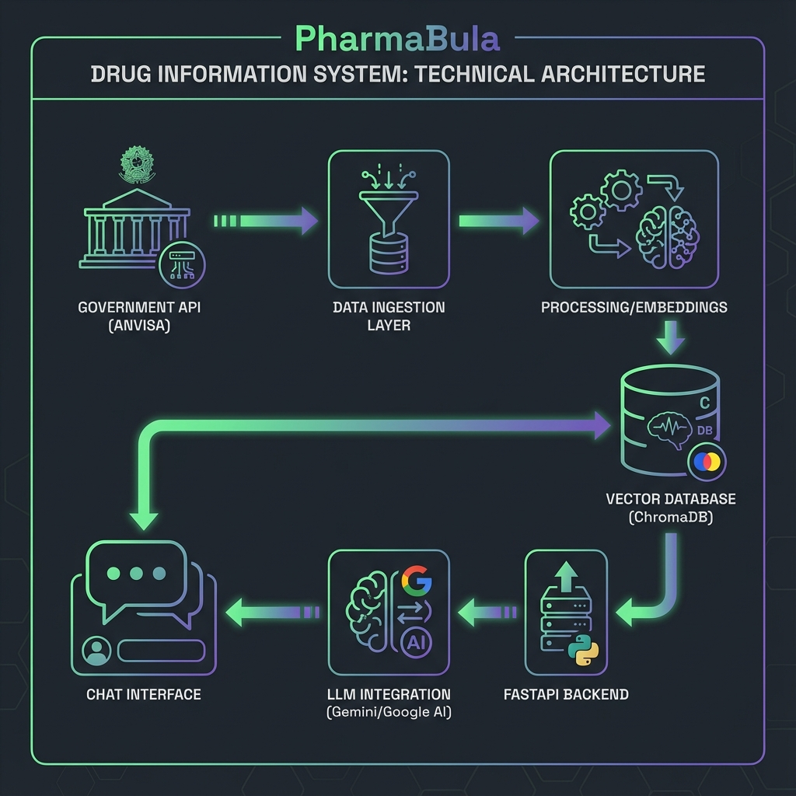

# 💊 PharmaBula

[](https://python.org)
[](https://fastapi.tiangolo.com)
[](LICENSE)

> **Assistente Inteligente de Medicamentos e Protocolos Clínicos** — Sistema RAG com Router Agent inteligente, integração à ANVISA e Protocolos Clínicos do SUS (PCDT)

<p align="center">
  
  <br>
  <em>Demo: Consulta de interação medicamentosa no modo profissional</em>
</p>

---

## 📋 Sobre o Projeto

O **PharmaBula** é uma aplicação web que combina técnicas modernas de recuperação de informação com modelos de linguagem para fornecer respostas precisas sobre medicamentos. O sistema foi desenvolvido como Trabalho de Conclusão de Curso (TCC) na Universidade Federal do Piauí (UFPI).

### ✨ Funcionalidades

- 🔍 **Busca Semântica** — Recuperação inteligente de informações usando embeddings e vector store
- 💬 **Chat Interativo** — Interface conversacional para perguntas sobre medicamentos
- 🤖 **Router Agent** — Sistema inteligente que seleciona ferramentas apropriadas para cada consulta
- 📋 **Protocolos Clínicos** — Acesso aos PCDT (Protocolos Clínicos e Diretrizes Terapêuticas) do SUS
- 👤 **Modos de Usuário** — Respostas adaptadas para pacientes ou profissionais de saúde
- ⚡ **Respostas Rápidas** — Sugestões pré-definidas para consultas comuns
- 📊 **API RESTful** — Endpoints documentados com FastAPI e Swagger UI
- 🔄 **Atualização Híbrida** — Dados on-demand da ANVISA com cache inteligente

---

## 🏗️ Arquitetura

<p align="center">
  
</p>

O sistema utiliza uma arquitetura híbrida multi-estágio:

```
┌─────────────────┐     ┌──────────────────┐     ┌─────────────────┐
│   ANVISA API    │────▶│  Data Ingestion  │────▶│  Vector Store   │
│   CONITEC       │     │   & Processing   │     │   (ChromaDB)    │
└─────────────────┘     └──────────────────┘     └────────┬────────┘
                                                          │
┌─────────────────┐     ┌──────────────────┐     ┌────────▼────────┐
│   Chat UI       │◀────│   FastAPI        │◀────│  Router Agent   │
│   (Frontend)    │     │   Backend        │     │  (7 Tools)      │
└─────────────────┘     └──────────────────┘     └────────┬────────┘
                                                          │
                                                 ┌────────▼────────┐
                                                 │  LLM (Gemini)   │
                                                 │  RAG Pipeline   │
                                                 └─────────────────┘
```

### Tecnologias Utilizadas

| Componente | Tecnologia |
|------------|------------|
| Backend | FastAPI, Python 3.10+ |
| Frontend | HTML5, CSS3, JavaScript |
| Vector Store | ChromaDB |
| LLM | Google Gemini API |
| Router Agent | Custom MPC-style + Pydantic |
| Scheduler | APScheduler |
| Data Sources | ANVISA API, CONITEC Portal |

---

## 🚀 Instalação

### Pré-requisitos

- Python 3.10+
- pip ou Poetry
- Chave de API do Google Gemini

### Passos

```bash
# Clone o repositório
git clone https://github.com/seu-usuario/pharmabula.git
cd pharmabula

# Crie um ambiente virtual
python -m venv venv
source venv/bin/activate  # Linux/macOS
# ou
.\venv\Scripts\activate   # Windows

# Instale as dependências
pip install -r requirements.txt

# Configure as variáveis de ambiente
cp .env.example .env
# Edite o arquivo .env com suas chaves de API
```

### Configuração do `.env`

```env
GEMINI_API_KEY=sua_chave_aqui
DATABASE_URL=sqlite:///./pharmabula.db
ANVISA_API_URL=https://api.anvisa.gov.br
DEBUG=true
```

---

## 💻 Uso

### Iniciando o Servidor

```bash
# Modo desenvolvimento
python -m uvicorn src.api.main:app --reload --port 8000

# Ou diretamente
python -m src.api.main
```

Acesse:
- 🌐 **Interface Web**: http://localhost:8000
- 📚 **API Docs**: http://localhost:8000/docs
- 📖 **ReDoc**: http://localhost:8000/redoc

### Endpoints da API

| Método | Endpoint | Descrição |
|--------|----------|-----------|
| `GET` | `/health` | Verifica status do sistema |
| `POST` | `/api/chat/` | Envia pergunta para o assistente |
| `GET` | `/api/drugs/` | Lista medicamentos disponíveis |
| `GET` | `/api/drugs/{id}` | Detalhes de um medicamento |
| `POST` | `/api/router/analyze` | Analisa requisição com Router Agent |
| `GET` | `/api/router/tools` | Lista ferramentas disponíveis |

### Exemplo de Requisição

```bash
curl -X POST http://localhost:8000/api/chat/ \
  -H "Content-Type: application/json" \
  -d '{"message": "Quais os efeitos colaterais do paracetamol?", "mode": "patient"}'
```

---

## 📁 Estrutura do Projeto

```
pharmabula/
├── src/
│   ├── api/              # FastAPI application
│   │   ├── main.py       # Entry point
│   │   └── routes/       # API endpoints (chat, drugs, router)
│   ├── database/         # Vector store & cache
│   ├── frontend/         # Static web interface
│   ├── llm/              # LLM client & Router Agent
│   │   └── router/       # Tool registry, schemas, executors
│   ├── scrapers/         # ANVISA & CONITEC data fetchers
│   ├── scheduler/        # Background jobs
│   └── services/         # Business logic
├── tests/                # Test suite
├── data/                 # Sample data
├── docs/                 # Documentation
├── requirements.txt
└── README.md
```

---

## 🧪 Testes

```bash
# Executar todos os testes
pytest

# Com cobertura
pytest --cov=src --cov-report=html

# Testes específicos
pytest tests/test_api.py -v
```

---

## 🎯 Roadmap

- [x] MVP com chat básico
- [x] Integração com Gemini API
- [x] Interface responsiva
- [x] Router Agent com seleção inteligente de ferramentas
- [x] Protocolos Clínicos (PCDT) do SUS
- [x] Sistema híbrido de atualização de dados
- [ ] Cache de embeddings
- [ ] Suporte offline
- [ ] App mobile (React Native)
- [ ] Notificações de recalls

---

## 👨‍💻 Autor

**Paulo Eduardo Borges do Vale**  
Bacharelado em Ciência da Computação — UFPI

- 📧 Email: paulo@ufpi.edu.br

**Orientador:** Prof. Dr. Pedro Santos Neto

---

## 📄 Licença

Este projeto está sob a licença MIT. Veja o arquivo [LICENSE](LICENSE) para mais detalhes.

---

## ⚠️ Aviso Legal

> Este assistente **não substitui orientação médica profissional**. As informações fornecidas são baseadas em bulas oficiais da ANVISA e devem ser utilizadas apenas como referência. Sempre consulte um profissional de saúde.

---

<p align="center">
  <sub>Desenvolvido com ❤️ para o TCC — UFPI 2025</sub>
</p>
