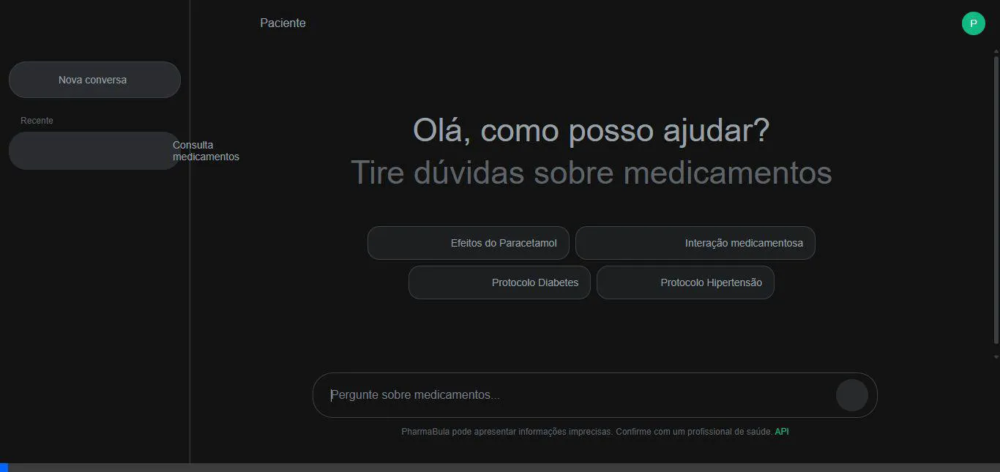

# 💊 PharmaBula

[](https://python.org)
[](https://fastapi.tiangolo.com)
[](LICENSE)

> **Assistente Inteligente de Medicamentos** — Sistema RAG multi-framework com agentes especializados, integração ANVISA e pipeline de juízes para respostas seguras

<p align="center">
  
  <br>
  <em>Demo: Consulta de interação medicamentosa no modo profissional</em>
</p>

---

## 📋 Sobre o Projeto

O **PharmaBula** é uma aplicação web que combina técnicas modernas de RAG (Retrieval-Augmented Generation) com múltiplos frameworks de LLM para fornecer respostas precisas e seguras sobre medicamentos. Desenvolvido como Trabalho de Conclusão de Curso (TCC) na UFPI.

### ✨ Funcionalidades

- 🔍 **Busca Semântica** — Recuperação inteligente usando ChromaDB e embeddings
- 💬 **Chat Interativo** — Interface conversacional com histórico de mensagens
- 🤖 **Multi-Framework** — Suporte a Claude (MCP), Gemini (LangChain) e GPT (OpenAI)
- ⚖️ **Pipeline de Juízes** — Avaliação de segurança, qualidade e atribuição de fontes
- 👤 **Modos de Usuário** — Respostas adaptadas para pacientes ou profissionais
- 📊 **API RESTful** — Endpoints documentados com FastAPI e Swagger UI

---

## 🏗️ Arquitetura Multi-Framework

```
┌─────────────────────────────────────────────────────────────────────┐
│                          PHARMABULA                                  │
├─────────────────────────────────────────────────────────────────────┤
│  config/                     src/shared/                            │
│  ├── settings.py             ├── schemas/                           │
│  └── Framework enum          │   ├── message.py                     │
│      (MCP|LANGCHAIN|OPENAI)  │   ├── judges.py                      │
│                              │   └── response.py                    │
├─────────────────────────────────────────────────────────────────────┤
│                     src/frameworks/                                  │
│  ┌──────────────┐  ┌──────────────┐  ┌──────────────┐               │
│  │     MCP      │  │  LangChain   │  │   OpenAI     │               │
│  ├──────────────┤  ├──────────────┤  ├──────────────┤               │
│  │ rag_impl.py  │  │ rag_impl.py  │  │ rag_impl.py  │               │
│  │ router.py    │  │ router.py    │  │ router.py    │               │
│  │ server.py    │  │              │  │              │               │
│  │ judges/      │  │ judges/      │  │ judges/      │               │
│  │ ├─safety.py  │  │ └─pipeline   │  │ └─pipeline   │               │
│  │ ├─quality.py │  │              │  │              │               │
│  │ └─pipeline   │  │              │  │              │               │
│  └──────────────┘  └──────────────┘  └──────────────┘               │
│         │                 │                 │                        │
│         └─────────────────┼─────────────────┘                        │
│                           ▼                                          │
│                    factory.py                                        │
│                    get_rag() → Agent                                 │
└─────────────────────────────────────────────────────────────────────┘
```

### Frameworks Suportados

| Framework | LLM Backend | Padrão de Agente | Recursos |
|-----------|-------------|------------------|----------|
| **MCP** | Anthropic Claude | Tool Calling | Prompt caching, MCP protocol |
| **LangChain** | Google Gemini | LCEL + ReAct | Chains compostas, @tool decorators |
| **OpenAI** | GPT-4 | Function Calling | JSON mode nativo, multi-turn |

---

## 🚀 Instalação

### Pré-requisitos

- Python 3.10+
- Pelo menos uma API key: `ANTHROPIC_API_KEY`, `GEMINI_API_KEY` ou `OPENAI_API_KEY`

### Setup

```bash
# Clone
git clone https://github.com/seu-usuario/pharmabula.git
cd pharmabula

# Ambiente virtual
python -m venv venv
source venv/bin/activate  # Linux/macOS
# ou: .\venv\Scripts\activate  # Windows

# Dependências
pip install -r requirements.txt

# Configuração
cp .env.example .env
```

### `.env` Configuration

```env
# Framework ativo (MCP, LANGCHAIN, OPENAI)
ACTIVE_FRAMEWORK=OPENAI

# API Keys (configure pelo menos uma)
ANTHROPIC_API_KEY=sk-ant-...
GEMINI_API_KEY=AIza...
OPENAI_API_KEY=sk-...

# Modelos
GENERATION_MODEL=claude-3-5-sonnet-20241022
GEMINI_MODEL=gemini-2.0-flash-exp
OPENAI_MODEL=gpt-4o

# Features
ENABLE_JUDGE_PIPELINE=true
MAX_CONTEXT_MESSAGES=10
```

---

## 💻 Uso

### Iniciando o Servidor

```bash
# API
python -m uvicorn src.api.main:app --reload --port 8000

# MCP Server (standalone)
python -m src.frameworks.mcp.server
```

Acesse:
- 🌐 **Interface Web**: http://localhost:8000
- 📚 **API Docs**: http://localhost:8000/docs

### Uso Programático

```python
from src.frameworks.factory import get_rag

# Obtém agente do framework ativo (.env)
rag = get_rag()

# Query com JSON response
response = await rag.query(
    "Quais os efeitos colaterais do paracetamol?",
    mode="patient"
)
# Returns: {"response": "...", "confidence": "alta", "sources": [...], "disclaimer": "..."}

# Ou especifique framework
from config.settings import Framework
rag_claude = get_rag(Framework.MCP)
rag_gemini = get_rag(Framework.LANGCHAIN)
rag_gpt = get_rag(Framework.OPENAI)
```

### Endpoints da API

| Método | Endpoint | Descrição |
|--------|----------|-----------|
| `POST` | `/api/chat/` | Envia pergunta para o assistente |
| `POST` | `/api/chat/interactions` | Verifica interações medicamentosas |
| `POST` | `/api/router/analyze` | Analisa com router (MCP/LangChain/OpenAI) |
| `GET` | `/api/router/tools` | Lista ferramentas disponíveis |
| `GET` | `/api/drugs/search?q=` | Busca medicamentos |

---

## 📁 Estrutura do Projeto

```
pharmabula/
├── config/
│   └── settings.py           # Configurações centralizadas
├── src/
│   ├── api/                  # FastAPI application
│   │   ├── main.py
│   │   └── routes/           # chat, drugs, router
│   ├── frameworks/           # Multi-framework implementations
│   │   ├── factory.py        # get_rag() factory
│   │   ├── mcp/              # Anthropic Claude
│   │   │   ├── rag_implementation.py
│   │   │   ├── router.py
│   │   │   ├── server.py     # MCP protocol server
│   │   │   └── judges/       # Safety, Quality, Source, Format
│   │   ├── langchain/        # Google Gemini
│   │   │   ├── rag_implementation.py
│   │   │   ├── router.py
│   │   │   └── judges/
│   │   └── openai/           # GPT-4
│   │       ├── rag_implementation.py
│   │       ├── router.py
│   │       └── judges/
│   ├── shared/               # Shared components
│   │   ├── schemas/          # Message, Document, Judge schemas
│   │   ├── interfaces/       # BaseRAG, BaseJudge
│   │   └── prompts/          # Generator, Judge prompts
│   ├── database/             # Vector store (ChromaDB)
│   ├── frontend/             # Web interface
│   ├── scrapers/             # ANVISA data fetchers
│   └── services/             # Business logic
├── tests/
├── data/
└── README.md
```

---

## ⚖️ Pipeline de Juízes

Cada resposta é avaliada por 4 juízes especializados:

| Juiz | Peso | Avalia |
|------|------|--------|
| **Safety** | 40% | Riscos de automedicação, emergências, disclaimers |
| **Quality** | 30% | Relevância, completude, precisão, clareza |
| **Source** | 20% | Atribuição de citações, claims sem suporte |
| **Format** | 10% | Estrutura, legibilidade, modo apropriado |

**Decisões possíveis**: `APPROVED`, `APPROVED_WITH_CAVEATS`, `NEEDS_REVISION`, `REJECTED`

---

## 🧪 Testes

```bash
pytest
pytest --cov=src --cov-report=html
```

---

## 👨‍💻 Autor

**Paulo Eduardo Borges do Vale**  
Bacharelado em Ciência da Computação — UFPI

**Orientador:** Prof. Dr. Pedro Santos Neto

---

## 📄 Licença

MIT License - veja [LICENSE](LICENSE)

---

## ⚠️ Aviso Legal

> Este assistente **não substitui orientação médica profissional**. As informações são baseadas em bulas oficiais da ANVISA. Sempre consulte um profissional de saúde.

---

<p align="center">
  <sub>Desenvolvido com ❤️ para o TCC — UFPI 2025</sub>
</p>
